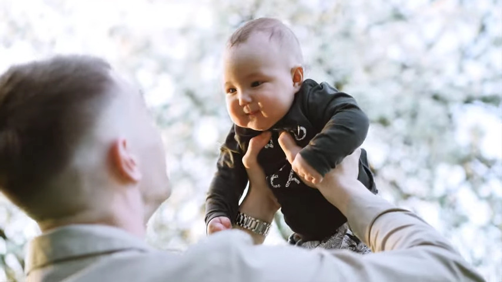

# Timecode Generator
## Automate Youtube descriptions
A python script designed to automate the process of creating chapters in YouTube videos by detecting scene changes and cuts. It works by downloading the video from a YouTube link, then using a heuristic scene change detector it finds all cuts in the video and saves timecodes in a /output directory.
## Generate chapter names
The script also has a simple chapter name generation based on the image after scene change. It uses [this](https://github.com/jmisilo/clip-gpt-captioning) small model based on OpenAI's CLIP and GPT-2 to generate a simple description for an image.
## Usage
* Have Python 3 installed
* Download model from [here](https://drive.google.com/file/d/1Gh32arzhW06C1ZJyzcJSSfdJDi3RgWoG/view?usp=sharing) and paste next to predict.py inside `src/clip_gpt_captioning/src/`
* Install requirements: `pip install -r requirements.txt`
* run \_\_main__.py
* Paste link to a video
* Timecodes and descriptions will be saved in output directory
## Example
Using this [example video](https://www.youtube.com/watch?v=kOBHegu6KoU):

1. Timecode: 00:19 Man holding a baby in a field.

3. Timecode: 00:40 Man in a blue shirt is holding a blue cup.

5. Timecode: 01:49 Man in a blue shirt is sitting at a desk with a computer.

## Best use case 
From my experience, scene change detection works best with videos that have static camera, simple shots that are different from each other. Chapter description works best for videos that have well lit and clear enviroments and have people. The best practical use case is for automatic generation of chapters in stock footage videos, since they fit all the criteria mentioned above.

## Notes
1. Scene detection is not perfect, especially with motion graphics. It works best for traditional videos with camera.
2. YouTube requires chapters be at least 10 seconds long. If scene changes happen quickly (like in highly edited videos), chapter length might be shorter than expected, so yo umight have to delete unneeded timecodes.
